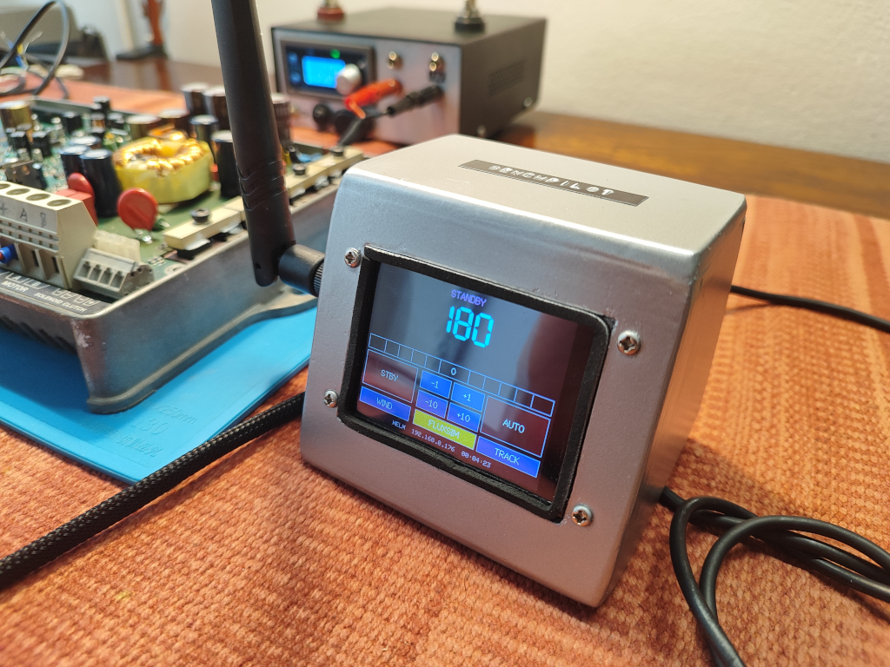

# BenchPilot

**Bench-test your Raymarine autopilot or replace the display on your boat.**

BenchPilot turns an ESP32 touchscreen display (ESP32-2432S028R CYD) into a SeaTalk 1 bus monitor and wireless control head. Connect it to a Raymarine SmartPilot S3 course computer on the bench or on the water. It generates heading data, decodes autopilot status, and lets you push buttons just like the real ST6002, all through a 320x240 color touchscreen or a WiFi web dashboard on your phone.



## What you can do

- **Replace your display.** Plug it into the existing SeaTalk bus and get heading, rudder, depth, wind, speed, and GPS on the touchscreen with no wiring changes needed.
- **Control from anywhere.** The built-in WiFi web dashboard works on any phone, tablet, or laptop. Adjust course or change modes without reaching for the helm.
- **Monitor.** See all SeaTalk traffic in real time, on-screen or remotely.
- **Simulate.** Built-in heading generator ("FluxSim") sends fake heading datagrams so you can test the autopilot's response on the bench without a compass.
- **Log.** Every bus datagram is saved to the SD card for later analysis.
- **Update.** Flash new firmware over WiFi (OTA) with no cables needed.

You need an ESP32-2432S028R "CYD" display board, a BenchPilot interface
PCB, and a 12V power supply (or the SeaTalk bus itself).

The interface circuit can be built in two ways. The `pcb/` folder contains
a Fritzing file (`BenchPilot_260715.fzz`), schematics, and a DIY etch PDF
(`BenchPilot_260715_diy_etch.pdf`) sized for printing on A4 transfer paper
with a regular printer. Print the PDF, iron the toner onto single-sided
copper clad board, then etch in ferric chloride or ammonium persulfate.
Drill the holes, solder the components, and the board is ready to plug into
the CYD and the SeaTalk bus.

The housing shown in the photo is made from 3mm PVC foam board (Foamex /
Sintra). Cut the front and back panels slightly larger than the CYD, then
cut out openings for the screen, the four buttons, and the USB port. Glue
the two panels together along three edges with regular PVC glue (leave the
top open so the CYD can slide in), or build a simple five-sided box with
the CYD seated behind the front cutout. A craft knife works well for the
foam board, it cuts cleanly and sands smooth.

## Getting started

1. Build the interface circuit using the DIY etch PDF or the Fritzing files
2. Copy `src/wifi_config.example.h` to `src/wifi_config.h`, add your WiFi
3. Build and upload with PlatformIO:
   ```
   pio run -t upload
   ```
4. Connect to the BenchPilot WiFi access point or join your network
5. Open http://benchpilot.local in your browser

## License

GNU General Public License v3.0
